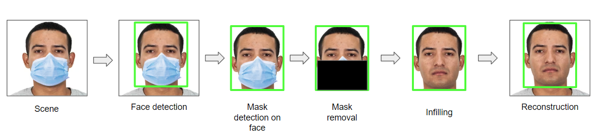

# Unmask: A realtime face-mask infiller

## Problem statement

COVID-19 has had a lasting impact on how we live and perceive things. Due to the masking norms required as part of the protocol, it was hard to have a personal connection and identify people we normally could recognise in pre-COVID times. The mask interfered with many aspects of day-to-day life. We propose 'Unmask', a realtime masked-face unmasker which identifies faces using Haar cascade classifiers, identifies if the face is masked or not, segments the mask using simple heuristics and uses a simple UNet model to complete the remainder.

## Datasets used

1. <a href = "https://www.kaggle.com/datasets/ashishjangra27/face-mask-12k-images-dataset">Face Mask Detection ~12K Images dataset</a>
2. <a href = "https://mmlab.ie.cuhk.edu.hk/projects/CelebA.html">CelebA dataset</a>

## Pipeline

## Model specifications

1. Mask detection: we use a 3-layer convolutional neural network with 5, 10 and 10 kernels respectively trained on images of size 64x64.
2. Infiller: We use an EfficientNet_B0 encoder in a UNet architecture. The model was trained on images of size 64x64.

## Demo

The working code can be found in the RUN.ipynb file. Do note that this is in the early phases and optimised for speed. The accuracy of face detection, mask detection and infilling can be improved tremendously.

